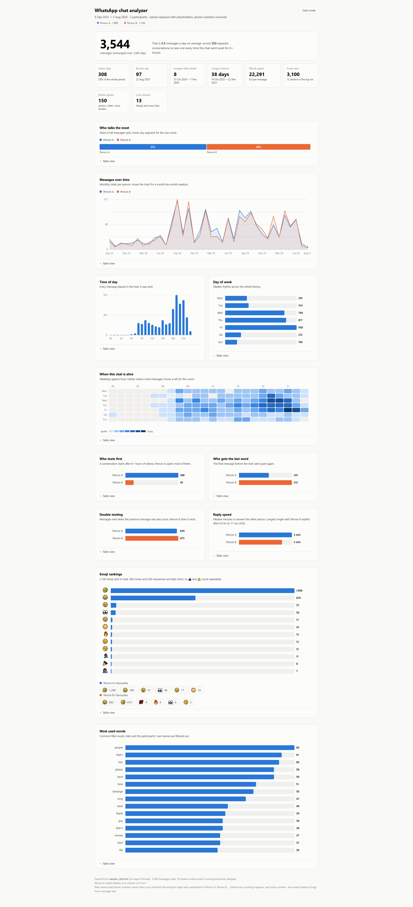
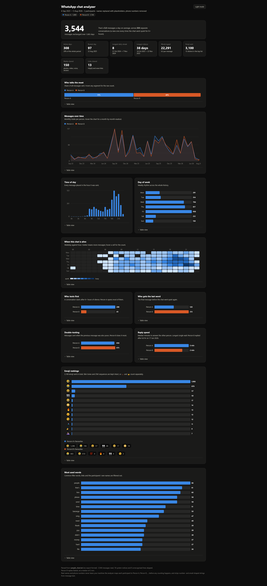

# WatsUpp_Chat_Analyzer_For_Businesses
Parse an exported Whats-App chat and turn it into a single self-contained HTML dashboard: who texts first, who double-texts, who replies fastest, emoji rankings, message volume over time, and a weekday × hour activity heatmap.

**Standard library only.** No `pip install`, no network calls, nothing leaves
your machine.

```
python analyze.py sample_chat.txt --open
```

## What you get

`chat_report.html` — one file, no external assets. Open it, screenshot it,
send it to someone. It has a light and dark theme, hover tooltips on every
mark, and a "Table view" under each chart so the numbers are readable without
relying on colour.

Sections:

| Section | What it answers |
|---|---|
| Hero + stat tiles | totals, active days, busiest day, longest streak, longest silence |
| Who talks the most | share of all messages per person |
| Messages over time | monthly volume per person, with a crosshair readout |
| Time of day / Day of week | when the chat happens |
| When this chat is alive | weekday × hour heatmap |
| Who texts first | who opens conversations after a lull |
| Who gets the last word | who sends the final message before it goes quiet |
| Double-texting | messages sent when the previous one was also yours |
| Reply speed | median time to answer the other person |
| Emoji rankings | top emoji overall and per person |
| Most used words | with stopwords, links and names filtered out |

Light Mode


Dark Mode



## Privacy

You asked for this, and it is enforced in code rather than by convention:

- Every participant is mapped to **Person A, Person B, …** (ordered by message
  count) *before* any counting happens. The real names exist only inside the
  parser and are never passed to the analytics or report layer.
- Phone numbers and email addresses are stripped from message text.
- Words that look like proper nouns — capitalised mid-sentence more often than
  not — are dropped from the word ranking, so third parties mentioned in the
  chat are not named in the report either.
- `python tests.py` asserts all of the above against the generated HTML.

## Usage

```
python analyze.py CHAT.txt [options]

  -o, --output FILE     where to write the dashboard (default: chat_report.html)
      --gap-hours N     silence that starts a new conversation (default: 6)
      --date-order      auto | dmy | mdy — force day/month order if ambiguous
      --open            open the dashboard in your browser when done
      --quiet           skip the console summary
```

The console summary prints the headline table so you can sanity-check a run
without opening the file.

## Exporting a chat from WhatsApp

Open the chat → ⋮ / contact name → **Export chat** → **Without media**.
You get a `.txt` file; that is the input. Both the iOS format
(`[06/09/2023, 1:16:35 PM] Name: text`) and the Android format
(`06/09/2023, 1:16 pm - Name: text`) are supported.

## How it handles real exports

- iOS and Android layouts, 12-hour and 24-hour clocks, `-` and `–` separators.
- Day/month order is inferred from the **whole file**, not one line, so
  `04/05/2024` is not guessed at in isolation. Override with `--date-order`.
- Multi-line messages are joined back onto the message they belong to.
- Media placeholders (`image omitted`, `<Media omitted>`, stickers, voice
  notes) are counted as media, not as words.
- System notices (encryption notice, "X left", missed calls, deleted messages)
  are counted separately and excluded from every per-person statistic.
- `<This message was edited>` is stripped so it does not pollute word counts.
- Group chats of any size work; the first eight people get distinct colours,
  the rest reuse the palette in order.
- Emoji are extracted as grapheme clusters, so 👍 and 👍🏿 count separately and
  👩‍👩‍👧 counts once.

## Definitions

- **Conversation** — a run of messages with no gap of `--gap-hours` (default 6)
  or more. The first message of a run is a *conversation start*; the last
  message before the gap is a *conversation end*.
- **Double text** — a message whose immediately preceding message, inside the
  same conversation, came from the same person.
- **Reply time** — minutes between the other person's last message and your
  first message back, within a conversation. The report shows the **median**,
  which is not thrown off by the one time someone answered three days later.

## Layout

```
analyze.py              entry point
tests.py                self-checks (42 assertions, run it after any change)
whatsapp_analyzer/
  parser.py             export -> Message objects
  anonymize.py          real identities -> Person A/B/C
  analytics.py          every number the dashboard shows
  emoji.py              grapheme-cluster emoji extraction
  charts.py             SVG marks (bars, columns, lines, heatmap)
  report.py             assembles the HTML
  cli.py                argument parsing and console summary
```

Use it as a library too:

```python
from whatsapp_analyzer import parse_file, anonymize, analyse, build_html

chat = parse_file("sample_chat.txt")
clean, aliases, banned = anonymize(chat)
report = analyse(clean, gap_hours=6, banned_tokens=banned)
print(report.starters, report.double_texts, report.top_emoji[:5])
```

## Tests

```
python tests.py            # uses sample_chat.txt for the recount
python tests.py other.txt
```

The last block re-counts the export with a deliberately naive second parser and
asserts the module agrees on totals, per-person counts, conversation count and
double-text count — so a refactor that quietly changes the numbers gets caught.


